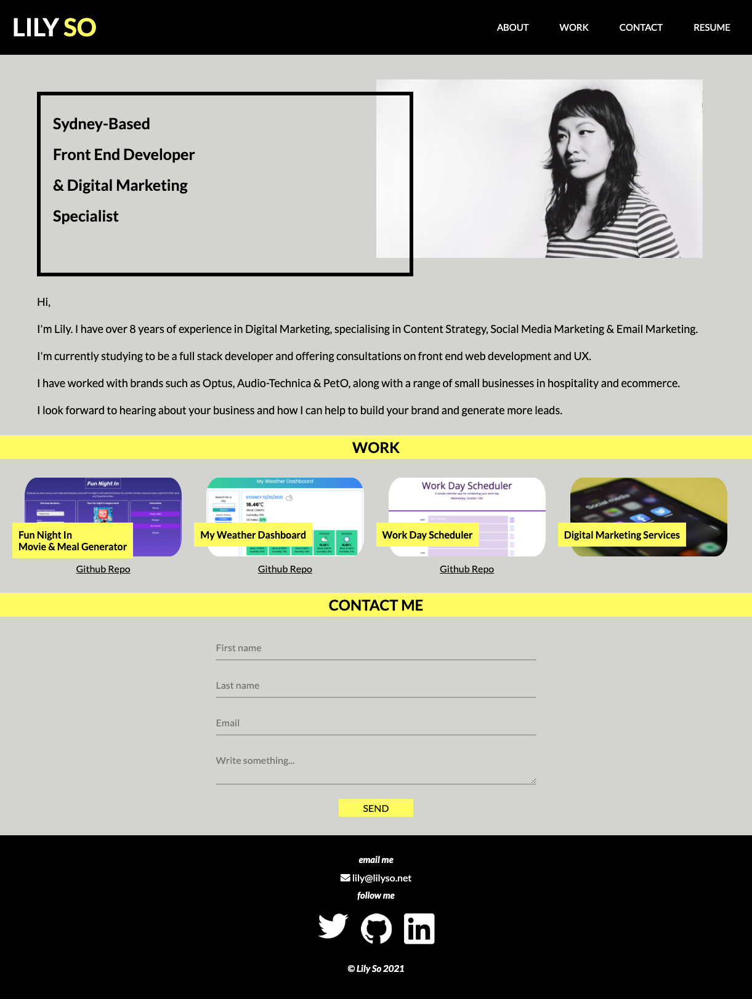
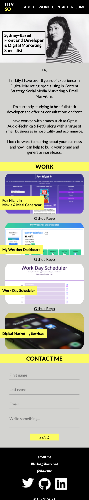

# Lily So's Portfolio

> This is a portfolio website showcasing Lily So's current development work and skills. The website offers a range of services from digital marketing, front end development and photography.

> Live demo [_here_](https://lilyso.github.io/lilyso-portfolio-2021/).

## Table of Contents

- [General Info](#general-information)
- [Technologies Used](#technologies-used)
- [Features](#features)
- [Screenshots](#screenshots)
- [Setup](#setup)
- [Project Status](#project-status)
- [Room for Improvement](#room-for-improvement)
- [Acknowledgements](#acknowledgements)
- [Contact](#contact)
- [License](#license)

## General Information

- The portfolio website aims to showcase Lily So's skills and projects in web development and digital marketing. The website includes links to work examples, a contact form and social links.

## Technologies Used

- HTML5
- CSS3
- JavaScript

## Features

- Links to examples of current and previous work.
- Contact form

## Screenshots

## Setup

- Git clone from repository.

## Project Status

This project is in its second draft.

## Room for Improvement

- More pages are required to show full scope of experience.
- An addition of a blog page would offer more insight into the author's work history and projects.

## Acknowledgements

- Colour scheme generated by [coolors.co](https://coolors.co/fcfc62-feffea-c9c9c9-a3a3a3-424242).
- Stock images provided by [unsplash.com](https://unsplash.com/).

## Contact

Created by [@lilyso](https://github.com/lilyso).

# License

- MIT
