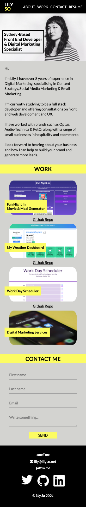

# Lily So's Portfolio

> This is a portfolio website showcasing Lily So's current development work and skills. The website offers a range of services from digital marketing, front end development and photography. 

> Live demo [_here_](https://lilyso.github.io/lilyso-portfolio/).

## Table of Contents
* [General Info](#general-information)
* [Technologies Used](#technologies-used)
* [Features](#features)
* [Screenshots](#screenshots)
* [Setup](#setup)
* [Project Status](#project-status)
* [Room for Improvement](#room-for-improvement)
* [Acknowledgements](#acknowledgements)
* [Contact](#contact)

## General Information
- The portfolio website aims to showcase Lily So's skills and projects in web development and digital marketing. The website includes links to work examples, a contact form and social links.

## Technologies Used
- HTML5
- CSS3

## Features
- Links to examples of current and previous work.
- Contact form

## Screenshots

## Setup

- Git clone from repository.

## Project Status

This project is in its first draft. More pages are required to link to the work tiles. "Work" tiles currently contain a placeholder link to a website the author contributes to. 

## Room for Improvement

The website requires separate pages for examples of work & experience as listed in the "Work" section. An addition of a blog page would offer more insight into the author's work history and projects. 

To do:

- Page needs to be created to link to "photography" with examples or gallery.
- Page needs to be created to link to "copywriting" with examples/links.
- Pages needs to be created to link to content strategy and digital marketing sevices.
- Social icons need to be linked to business pages. 
- More tiles to be added to show more development work.
- Blog to be added.
- Page created to showcase web development skills and experience. 

## Acknowledgements

- Colour scheme generated by [coolors.co](https://coolors.co/fcfc62-feffea-c9c9c9-a3a3a3-424242).
- Stock images provided by [unsplash.com](https://unsplash.com/).

## Contact
Created by [@lilyso](https://github.com/lilyso).